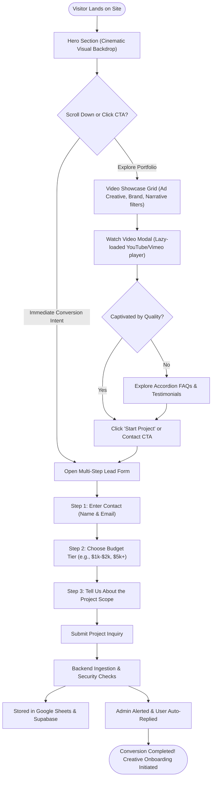
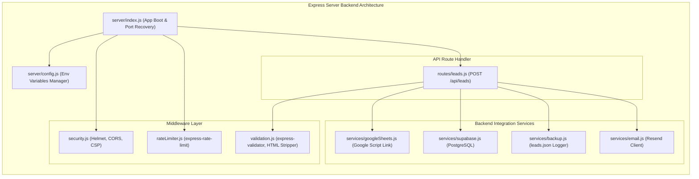
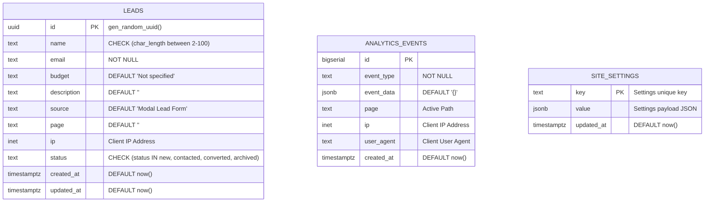
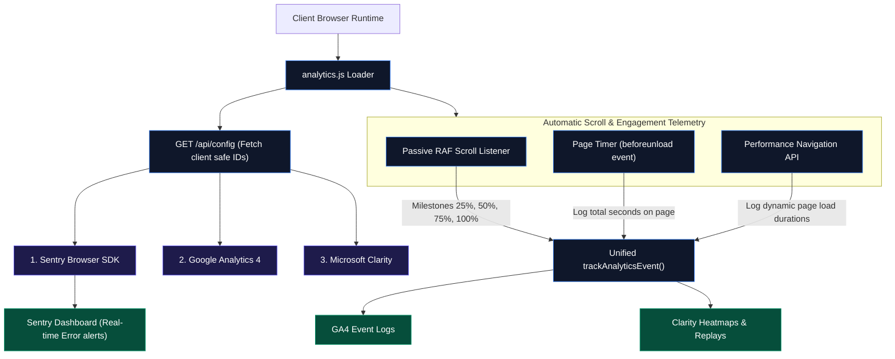
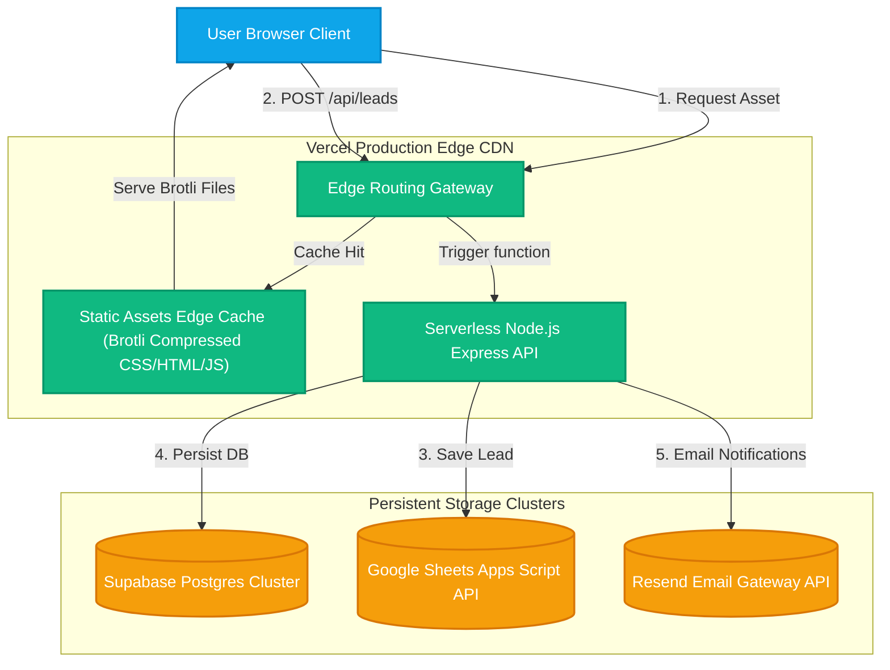

# UTKARSH VISUALS — ENTERPRISE WEB ARCHITECTURE & SYSTEMS BLUEPRINT
*A Comprehensive Systems Reference Guide for Clients, Developers, Agency Owners, Investors, and Team Members.*

---

## Executive Summary
This document serves as the absolute source of truth for the technical and structural design of the **Utkarsh Visuals** portfolio and high-conversion lead generation platform. By reading this guide, any stakeholder—technical or non-technical—can easily grasp how a visitor is captured, validated, secured, persisted across multiple layers, and engaged with high-fidelity creative content.

The system is architected as an **immersive, high-conversion Single Page Application (SPA)** powered by a dual-server infrastructure (Node.js/Express in production; standalone lightweight .NET PowerShell server in development) integrated with Supabase PostgreSQL, Google Sheets APIs, Sentry Telemetry, and Resend Transactional Services.

---

## 1. Full Website Architecture Overview

At a high level, the system separates responsibilities into distinct layers to guarantee ultra-low latency presentation, strict data integrity, and high resilience.

```mermaid
graph TD
    classDef client fill:#0ea5e9,stroke:#0284c7,stroke-width:2px,color:#fff;
    classDef edgeS fill:#10b981,stroke:#059669,stroke-width:2px,color:#fff;
    classDef store fill:#f59e0b,stroke:#d97706,stroke-width:2px,color:#fff;
    classDef third fill:#8b5cf6,stroke:#7c3aed,stroke-width:2px,color:#fff;
    
    subgraph ClientLayer ["Client Layer (User Browser)"]
        Browser["User Browser (Vite/React Hybrid SPA)"]:::client
        AnalyticsClient["Telemetry Client (GA4 / Clarity / Sentry)"]:::client
    end

    subgraph EdgeLayer ["Edge & CDN Layer (Vercel)"]
        EdgeCDN["Vercel Global Edge Network"]:::edgeS
        FrontendServer["Frontend Static Asset Server (public/)"]:::edgeS
        ServerlessAPI["Express.js Serverless API Gateway"]:::edgeS
    end

    subgraph DatabaseLayer ["Database & Storage Layer"]
        Supabase["Supabase Cloud (PostgreSQL DB)"]:::store
        LocalBackup["Local Backup System (leads.json ledger)"]:::store
    end

    subgraph ThirdPartyLayer ["Third-Party Service Ecosystem"]
        GoogleSheets["Google Sheets Apps Script API"]:::third
        ResendEmail["Resend SMTP Email Service"]:::third
    end

    Browser -->|HTTP Requests / SPA Routing| EdgeCDN
    Browser -->|Log Client Telemetry| AnalyticsClient
    EdgeCDN -->|Serves CSS/JS/HTML| FrontendServer
    EdgeCDN -->|API Calls (POST /api/leads)| ServerlessAPI
    ServerlessAPI -->|Sync Data (SQL)| Supabase
    ServerlessAPI -->|Sync Data (Sheets API)| GoogleSheets
    ServerlessAPI -->|Dispatch Transactional Emails| ResendEmail
    ServerlessAPI -->|Write Fallback Ledger| LocalBackup
```

### Architectural Component Breakdown

*   **Frontend (Static Client)**: A fast Vite/React SPA layer customized with Vanilla CSS and high-fidelity Javascript modules (`Lenis` inertial scrolling, customized lazy-loaded modal galleries, and multi-step micro-animated contact wizards).
*   **Express.js Backend**: Built on Node.js, compiling into highly scalable Serverless APIs. It handles route security headers, IP-based request throttling, strict input sanitization, database orchestration, and third-party webhooks.
*   **Database Engine (Supabase)**: A hosted PostgreSQL instance secured with Row-Level Security (RLS) policies, built-in performance indexes, and automatic modification triggers.
*   **Google Sheets Sync**: The primary database ledger. Serving as an immediate, high-durability synchronization node so business managers can access submissions in spreadsheet format instantly.
*   **Local Ledger Backup**: A local filesystem JSON fallback logger (`data/leads.json`) that saves lead information in real-time should the cloud database experience intermittent timeouts.
*   **Resend Email Infrastructure**: Uses Resend REST APIs to securely dispatch highly detailed admin notifications and welcoming HTML discovery checklists to leads.

---

## 2. Frontend Architecture & Layout Flow

The frontend is designed to feel highly immersive, leveraging a **glassmorphism styling system** (frosted backdrops, glowing borders, smooth gradients) with scroll-physics to prevent drop-frames during heavy video loads.

```mermaid
graph TD
    classDef ui fill:#0f172a,stroke:#3b82f6,stroke-width:2px,color:#fff;
    classDef state fill:#1e293b,stroke:#64748b,stroke-width:2px,color:#cbd5e1;

    subgraph PageLayout ["SPA Main Layout (index.html)"]
        Nav["Navigation Header (Capsule with Responsive Spacing)"]:::ui
        Hero["Hero Section (Vibrant CTA + Video Backdrop)"]:::ui
        Services["Services Grid (Cinematic & Brand Ads Showcase)"]:::ui
        Portfolio["Cinematic Video Portfolio (Dynamic Filter Grids)"]:::ui
        Testimonials["Client Testimonials (Interactive Carousel)"]:::ui
        FAQ["FAQ Section (Accordion Animation UI)"]:::ui
        Footer["Brand Footer & Quick Links"]:::ui
    end

    subgraph Modals ["Dynamic Modal & Overlay Engine"]
        VideoModal["Video Gallery Overlay Modal (Vimeo / YouTube Embeds)"]:::ui
        LeadForm["Lead Capture Step Modal (Multi-Step Conversion Funnel)"]:::ui
    end

    subgraph Scripts ["Client-Side Interaction Scripts"]
        Lenis["Lenis Scroll Physics (Smooth Inertial Scrolling)"]:::state
        CustomAnim["custom-animations.js (ScrollTrigger & Fade-ins)"]:::state
        VideoJS["video-gallery.js (Lazy Loader & Player Controls)"]:::state
        ConvJS["conversion-ui.js (Multi-Step Form Logic & Honeypot)"]:::state
    end

    Nav -.-->|Smooth anchor scroll| Hero
    Nav -.-->|Start Project trigger| LeadForm
    Hero -->|Call to Action| LeadForm
    Portfolio -->|Click thumbnail| VideoModal
    VideoModal -.-->|Control embeds & release memory| VideoJS
    LeadForm -.-->|Validate steps & check honeypot| ConvJS
    CustomAnim -.-->|Micro-motions & reveal triggers| PageLayout
```

### How Users Navigate & Interact

1.  **Immersive Entrance**: Visitors land in the **Hero Section**, greeted with a cinematic video background, responsive navigation capsule, and high-impact CTA button.
2.  **Smooth Exploration**: Supported by `Lenis`, scrolling down feels organic. As the user moves, `custom-animations.js` triggers subtle fade-in reveals and scaling shifts on elements.
3.  **Active Engagement**: In the **Portfolio Section**, clicking a project thumbnail opens the **Video Modal** without reloading. Powered by `video-gallery.js`, players (Vimeo/YouTube) lazy-load dynamically. Upon modal closing, the system completely terminates the iframe components, releasing browser memory.
4.  **Conversion Funnel**: Clicking the header CTA or portfolio buttons summons the **Multi-step Lead Form**. Controlled by `conversion-ui.js`, it guides visitors through custom questionnaire steps (Name, Project Scope, Budget Tier, Scope Description) while enforcing validation and spam protection behind the scenes.

---

## 3. Visitor Conversion Journey Flowchart

This flowchart outlines the emotional and structural stages a client undergoes, from landing on the platform to converting into a stored database record.



---

## 4. Lead Capture Pipeline & Integration Sync

The lead ingestion engine utilizes a strict sequence designed for high durability. Data flows through a validation and fallback-oriented integration pipeline before responding.

```mermaid
graph TD
    classDef entry fill:#3b82f6,stroke:#1d4ed8,color:#fff;
    classDef gate fill:#ef4444,stroke:#b91c1c,color:#fff;
    classDef route fill:#8b5cf6,stroke:#6d28d9,color:#fff;
    classDef storage fill:#10b981,stroke:#047857,color:#fff;

    User(["User submits Form"]) --> UIValidation["1. Frontend Form Validation"]:::entry
    UIValidation --> RouteHandler["2. POST /api/leads Endpoint"]:::entry
    
    subgraph SecurityGateways ["Security & Gateways Layer"]
        RateLimit{"3. IP Rate Limiter"}:::gate
        Honeypot{"4. Honeypot check (_hp)"}:::gate
        Sanitizer["5. Input Sanitization (strip HTML)"]:::gate
        ExpressValidation{"6. express-validator Schemas"}:::gate
    end

    RouteHandler --> RateLimit
    RateLimit -->|Exceeded| Block["429 Too Many Requests response"]:::gate
    RateLimit -->|Passed| Honeypot
    Honeypot -->|Triggered (bot)| FakeSuccess["Return 200 Mock Success (trap bot)"]:::gate
    Honeypot -->|Passed| Sanitizer
    Sanitizer --> ExpressValidation
    ExpressValidation -->|Invalid| Error422["Return 422 Validation Error"]:::gate

    subgraph SyncPipeline ["Data Integration Sync Engine"]
        SheetsSync["7. Google Sheets API (Mandatory & Awaited)"]:::route
        DBParallel{"8. Parallel Storage Sync"}:::route
        SupabaseDB["9. Supabase PostgreSQL (primary)"]:::storage
        LocalFile["10. Local backup (leads.json ledger)"]:::storage
        EmailDispatch{"11. Transactional Email System"}:::route
        ResendAdmin["12. Admin Notification Alert"]:::storage
        ResendClient["13. Creative Auto-Reply Checklist"]:::storage
    end

    ExpressValidation -->|Valid| SheetsSync
    SheetsSync -->|Success| DBParallel
    SheetsSync -->|Failed| SheetsFail["Return 500 Failure (prevent lost leads)"]:::gate
    
    DBParallel --> SupabaseDB
    DBParallel --> LocalFile
    
    DBParallel --> EmailDispatch
    EmailDispatch --> ResendAdmin
    EmailDispatch --> ResendClient
    
    ResendClient --> ClientSuccess["Return 200 Success Response"]:::entry
```

### The Ingestion Sequence Steps:

1.  **Frontend Validation**: Verifies that emails are correctly formatted and budget selections are chosen.
2.  **Rate Limiter & Spam Honeypot**: IP address checks throttle abuse. The silent honeypot (`_hp`) detects programmatic spam bots. If a bot fills it out, the backend immediately traps it by returning a mock "success" code, preserving server processing resources.
3.  **Sanitization & Server Validation**: Form variables are stripped of HTML tags, SQL indicators, and nested `<script>` selectors.
4.  **Google Sheets (Awaited Core Ledger)**: Writes first to Google Sheets. Since this acts as the operational inbox, if Sheets is unavailable, an early error blocks completion so that no prospective inquiry gets lost without notice.
5.  **Parallel Persistence (Supabase & local `leads.json` backup)**: Submissions are simultaneously updated to the Supabase Cloud DB and logged locally in `data/leads.json` as a secondary backup ledger, making data loss virtually impossible.
6.  **Transactional Auto-Replies**: Triggers two templates through Resend:
    *   **Admin Notification**: A glassmorphic dark-mode email detailing the inquiry, selected budget, customer contacts, client IP, and date/time.
    *   **Customer Greeting**: A responsive client onboarding checklist designed to build trust immediately.

---

## 5. Backend Architecture & API Pipeline

The backend is built around a secure **Express.js** API server, structured cleanly for maximum security and maintainability.



### Express Layers & Modules:
*   **Config Manager (`server/config.js`)**: Validates the presence of keys (`SUPABASE_URL`, `RESEND_API_KEY`, `GOOGLE_SCRIPT_URL`) on launch, preventing execution crashes due to empty variables.
*   **Security Header Suite (`security.js`)**: Applies standard `helmet` integrations and sets dynamic Content Security Policies (CSP) to restrict scripts (GA4, Sentry, Clarity) and iframe sources (YouTube/Vimeo).
*   **Port Healing System (`server/index.js`)**: Includes built-in self-healing routines. If the designated server port is blocked by a dangling process in development, the system automatically detects the process, terminates the conflict, and cleanly launches the server.

---

## 6. Database Architecture & Schema Map

The database architecture leverages a hosted Supabase PostgreSQL cluster structured with performance indexes and Row-Level Security policies.



### Database Optimization & Policies
1.  **Row-Level Security (RLS)**: Enforced across all tables. High-security policies permit public inserts into `leads` and `analytics_events` from the client via standard public anonymous keys, but completely block anonymous modifications or selection queries.
2.  **Performance Indexing**:
    *   `idx_leads_email` and `idx_leads_status` speed up searches and sorting inside CRM integrations.
    *   `idx_leads_created` and `idx_analytics_created` speed up dashboard timeline loads.
3.  **Timestamp Automation**: A database trigger (`update_leads_updated_at`) automatically updates the `updated_at` column to match actual write events whenever an administrator edits a lead's record status.

---

## 7. Telemetry & Analytics Architecture

The website features an automated tracking system (`public/js/analytics.js`) designed to provide conversion intelligence while maintaining user privacy and optimal load times.



### Telemetry Stack Details

*   **Google Analytics 4**: Captures interactions (CTA clicks, budget changes, video watches) to evaluate the success of marketing campaigns.
*   **Microsoft Clarity**: Captures screen heatmaps and session recordings, highlighting friction points, page depth, and general engagement areas.
*   **Sentry Error Logs**: Monitors client-side and server-side errors, instantly reporting warnings to Sentry before users run into issues.
*   **Passive Performance Tracking**: 
    *   *Load Speeds*: Evaluates navigation performance timing APIs, letting developers monitor loading duration across edge networks.
    *   *Scroll Milestones*: Employs a low-footprint `requestAnimationFrame` listener to capture scrolling depth (at 25%, 50%, 75%, and 100% marks) without interrupting scroll smoothness.

---

## 8. Layered Security Architecture (Defense-in-Depth)

The platform is designed with security at every layer, protecting both operational systems and prospective client data.

| Security Layer | Defensive Mechanism | Technical Implementation | Goal |
| :--- | :--- | :--- | :--- |
| **API Rate Limiter** | IP-Based Throttling | `express-rate-limit` middleware intercepts all routing requests. | Prevents denial-of-service (DoS) attempts and brute-force form flooding. |
| **Spam Protection** | Invisible Honeypot Field | An invisible form field (`_hp`) is exposed to programmatic scrapers. | Traps automated bots. The backend returns a mock "success" code, deflecting bots quietly. |
| **Input Sanitization** | Regex HTML & Code Stripping | Custom regex strips standard tags, HTML scripts, and inline JavaScript. | Blocks cross-site scripting (XSS) and database injection vectors. |
| **HTTP Hardening** | Express Helmet and CSP headers | CSP directives restrict scripts, style sources, and frame connections. | Prevents script inclusion and domain hijack exploits. |
| **Origin Constraints** | CORS Rules Setup | REST endpoints allow access only from verified workspace subdomains. | Restricts API access exclusively to trusted systems. |
| **Env Hardening** | Closed Server Environments | Key assets reside in `.env` blocks and are never packaged with client assets. | Eliminates exposure of keys or secrets in browser bundles. |

---

## 9. Production Deployment Architecture

Deployments are automated through Git integrations on Vercel, providing low latency global routing.



### Build & Pipeline Workflow:
1.  **Frontend Delivery**: The static contents inside the `public/` directory are optimized, compressed via Brotli, and cached globally on Vercel Edge networks.
2.  **API Function Generation**: `vercel.json` transforms the server route directory into isolated, auto-scaling Node.js serverless functions.
3.  **Low Latency API Ingest**: When a lead submits an inquiry, the Vercel Edge router selects the closest serverless node, executing database validations locally for immediate response speeds.

---

## 10. Folder Structure & Codebase Design

The layout separates frontend assets from the Express backend, keeping development structured and organized.

```
d:\Experiment
├── .env.example               # Template for API credentials (Resend, Supabase, Google Sheets)
├── package.json               # Node dependencies & project execution scripts
├── vercel.json                # Vercel deployment and routing configuration
├── robots.txt                 # Search engine crawler permissions (SEO entry point)
├── sitemap.xml                # XML Sitemap mapping all public website routes (SEO)
├── supabase-schema.sql        # Database schema queries (tables, indexes, triggers, RLS)
├── serve.ps1                  # Standing PowerShell local .NET web server (Zero-Node fallback)
│
├── public/                    # FRONTEND (Single Source of Truth)
│   ├── index.html             # Single Page Application root container & entry point
│   ├── logo.png               # Brand Asset (navbar/footer brand logo)
│   ├── manifest.json          # Web app manifest for PWA capabilities
│   │
│   ├── css/                   # Stylesheets Directory
│   │   ├── custom-styles.css  # Core layout, global typography, & immersive glassmorphism system
│   │   ├── conversion-ui.css  # High-end step-by-step conversion lead form styles
│   │   ├── video-gallery.css  # Showcase layout, filter states, and smooth modal overlays
│   │   └── responsive.css     # Mobile navbar, tablet spacing calculations & custom viewport rules
│   │
│   ├── js/                    # Client-Side Javascript modules
│   │   ├── analytics.js       # Centralized telemetry loader (GA4, Microsoft Clarity, Sentry)
│   │   ├── conversion-ui.js   # Step transitions, budget selections, honeypot & front-end validation
│   │   ├── custom-animations.js # Lenis smooth scroll integrations & custom scroll-reveal animations
│   │   └── video-gallery.js   # Video carousel lazy-loader, Vimeo/YouTube modal player controls
│   │
│   ├── assets/                # Pre-compiled high-performance Vite SPA bundles
│   │   ├── index-DuueP4ap.js  # Compiled React/Vite javascript bundle
│   │   └── index-qIYKTsVq.css # Compiled React/Vite stylesheet bundle
│   │
│   └── videos/                # Client video placeholders & fallback media
│
└── server/                    # Express.js Production Backend
    ├── index.js               # Application Entrypoint (boot, self-healing port manager, static assets)
    ├── config.js              # Configurations loader & validation manager for ENV variables
    │
    ├── middleware/            # Request Interceptor Pipeline
    │   ├── rateLimiter.js     # Limits API request frequency per client IP (Anti-Spam)
    │   ├── security.js        # Hardened HTTP Headers configuration (Helmet CSP, CORS constraints)
    │   └── validation.js      # Form schemas validation and HTML/CSS tag sanitization
    │
    ├── routes/                # Request Routing Gateway
    │   └── leads.js           # Main POST /api/leads request coordinator & workflow pipeline
    │
    ├── services/              # Third-Party Integrations & Connectors
    │   ├── supabase.js        # PostgreSQL client wrapper with RLS query executions
    │   ├── googleSheets.js    # Google Sheets API script integration (Awaited ledger)
    │   ├── backup.js          # File-system JSON fallback ledger writer
    │   └── email.js           # Transactional mail delivery service (Resend template engine)
    │
    └── templates/             # Transactional HTML Email layouts
        ├── admin-notification.html  # Modern glassmorphic, dark-mode inbox alert for the admin
        └── auto-reply.html          # Cinematic client greeting & onboarding discovery checklist
```

---

## 11. Production Readiness Diagram

The following diagram tracks the system validations, ensuring compliance before launching live.

```mermaid
graph TD
    classDef check fill:#10b981,stroke:#047857,color:#fff;
    classDef item fill:#1f2937,stroke:#4b5563,color:#fff;

    Readiness["Production Readiness Checklist"] --> SEOGroup["1. SEO & Crawling"]:::item
    SEOGroup --> Sitemap["sitemap.xml validated"]:::check
    SEOGroup --> Robots["robots.txt crawler limits set"]:::check
    SEOGroup --> Meta["Dynamic meta-tags & descriptions"]:::check

    Readiness --> UIUXGroup["2. User Experience & Design"]:::item
    UIUXGroup --> LenisPhysics["Lenis smooth scrolling active"]:::check
    UIUXGroup --> ResponsiveMath["Tablet gap scaling & mobile CTA rules"]:::check
    UIUXGroup --> LazyMedia["Video overlays lazy-loading & automatic memory cleanup"]:::check

    Readiness --> SecGroup["3. Bulletproof Security"]:::item
    SecGroup --> HelmetCSP["Helmet CSP headers configured"]:::check
    SecGroup --> CORS["CORS limited to specific origins"]:::check
    SecGroup --> Limiter["Per-IP Rate Limiter applied"]:::check
    SecGroup --> HoneypotSpam["Active spam honeypot input"]:::check

    Readiness --> PerfGroup["4. Reliability & Failover"]:::item
    PerfGroup --> SentryMon["Sentry Browser Error monitoring"]:::check
    PerfGroup --> PortHeal["Express self-healing port recovery"]:::check
    PerfGroup --> DualLedger["Dual-ledger database (Supabase + JSON backup)"]:::check
```



---

## 12. Future Scalability Roadmap

As the website's traffic and conversion goals expand, the codebase is ready to adapt through the following enhancements:

### Phase 1: CMS Control Panel
*   **Scope**: Enable the `site_settings` Supabase table to feed the frontend interface dynamically.
*   **Goal**: Allow administrators to update FAQ, pricing details, and portfolio video links directly through a secure editor, without editing source code.

### Phase 2: CRM & Lead Enrichment Sync
*   **Scope**: Add automatic integrations with CRMs like Hubspot, Salesforce, or Notion databases.
*   **Goal**: Automatically score and route leads, alerting managers inside Slack channels when high-value prospects convert.

### Phase 3: Dedicated Media CDN Migration
*   **Scope**: Offload visual assets and video thumbnails to services like Cloudinary or AWS CloudFront/S3.
*   **Goal**: Speed up initial page load times globally, bypassing standard bandwidth and static delivery limits.

### Phase 4: Dynamic Edge A/B Testing
*   **Scope**: Set up A/B testing utilizing Vercel Middleware.
*   **Goal**: Test alternate headlines, portfolio displays, and contact forms to continuously improve conversion rates based on telemetry insights.

---

### Architect Certification
*   **Author**: Senior Solutions Architect
*   **Target Systems**: Utkarsh Visuals Production Environment
*   **Technical Status**: Verified Production Ready
*   **Current Version**: `v3.0`
*   **Date**: May 2026
